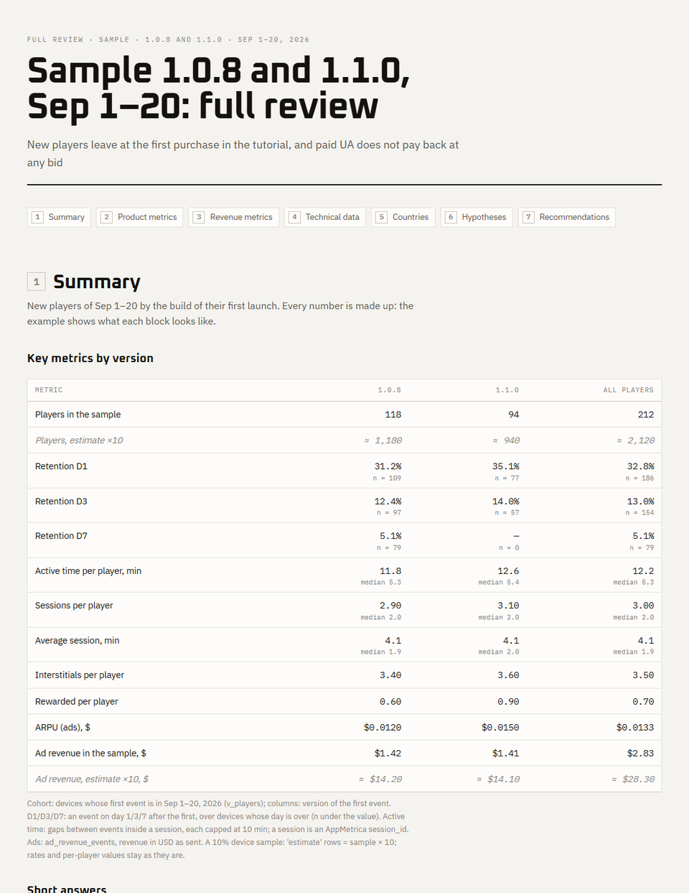
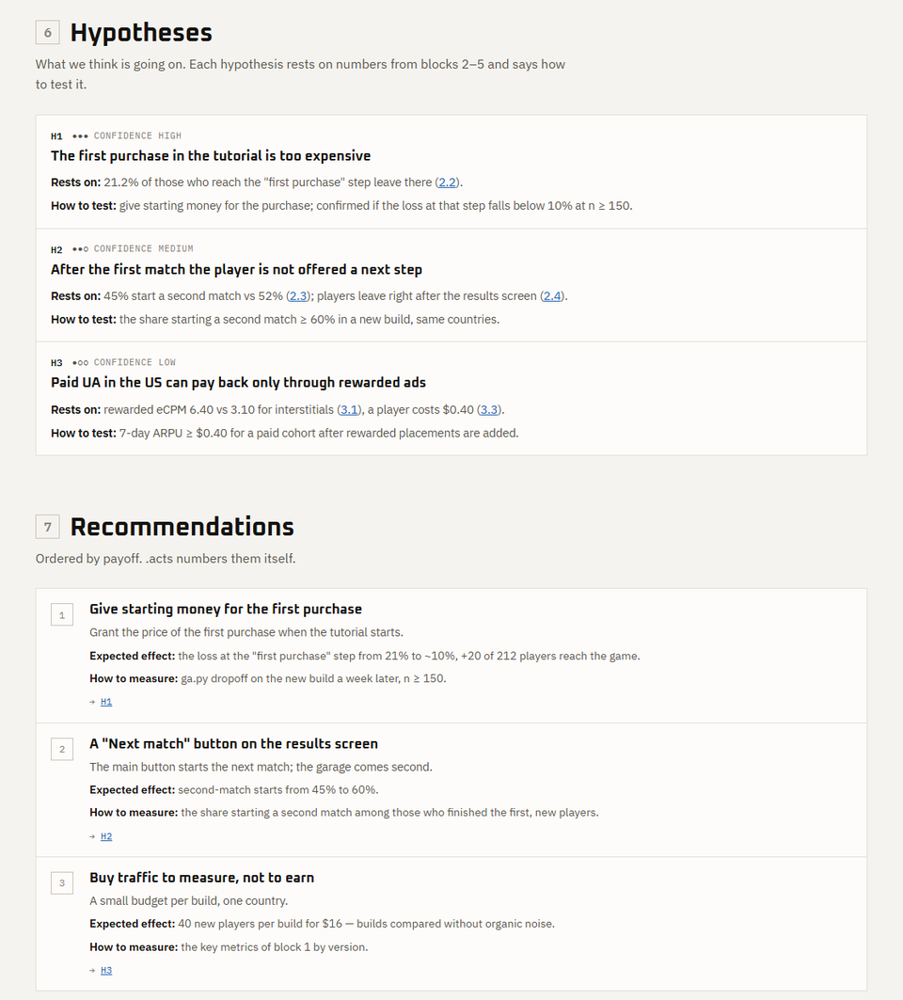

**English** · [Русский](README.ru.md)

# game-analytics-kit

[](https://github.com/Trafalgardi/game-analytics-kit/actions/workflows/ci.yml)
[](LICENSE)


**[Live example report](https://trafalgardi.github.io/game-analytics-kit/examples/sample/v002/report.html)** · [Site](https://trafalgardi.github.io/game-analytics-kit/) · [Quick start](#quick-start)

A kit that turns a coding agent — **Claude Code** or **OpenAI Codex** — into a game analyst.
Installed into a game project, it lets the agent pull the game's raw analytics into a local
database, learn what this particular game's events mean, answer product questions and
publish versioned reports: one HTML file per version that opens from disk and can be
forwarded to anyone.

The kit is the same for every project. Everything game-specific — event meaning, filters,
cohorts, queries, notes about the data — the agent writes inside the project, guided by the
kit's skills.



- [What you get](#what-you-get)
- [Quick start](#quick-start)
- [Working with Claude Code and Codex](#working-with-claude-code-and-codex)
- [What to ask](#what-to-ask)
- [Reports](#reports)
- [Big games](#big-games)
- [Updating and removing](#updating-and-removing)
- [The token and security](#the-token-and-security)
- [Troubleshooting](#troubleshooting)
- [Developing the kit](#developing-the-kit)

## What you get

**Seven skills** — instructions the agent loads when a request matches them. Installed for
both agents (`.claude/skills/` and `.agents/skills/`).

| Skill | What it does |
| --- | --- |
| `analytics-kit` | Entry point: what is installed, every command, which skill to use next, how to update |
| `analytics-connect-appmetrica` | Finds the SDK key in the game code, walks you through a read-only token, resolves the app, runs the first data pull |
| `analytics-data-model` | Learns the game's events and builds the project model: typed events, devices, developer-device filter, sessions, per-player metrics |
| `analytics-project-audit` | Compares what the code sends with what arrives: coverage, broken events, a tracking plan, data to request |
| `analytics-import-external` | Google Ads, AdMob, GA4 / Firebase, Play Console, App Store Connect: what to export, how to import and reconcile |
| `analytics-research` | The analyst: a question or a full review → data → hypotheses → independent check of the key numbers → report |
| `analytics-report` | Writes, builds, versions and publishes the report in one fixed structure |

**An engine** (`kit/gak`, Python standard library only — nothing to `pip install`): AppMetrica
Logs API sync by date ranges into SQLite, device sampling for big games, an event catalog, a
model scaffold, queries, CSV import from ad and store consoles, the standard tables of every
report (key metrics by build version, drop-off, core actions by their number in the session,
leaving after events), SVG charts and the report builder.

Sources today: **AppMetrica** events, sessions, installs, ad revenue, purchases, crashes and
errors; ad-network and store numbers come as CSV exports or screenshots. The engine has a
source interface for adding Firebase, GameAnalytics, devtodev and others.

## Quick start

You need:

- a game that already sends events to **AppMetrica** (the SDK is in the game and the app exists
  in the AppMetrica console) — it is the source the kit reads today;
- **Python 3.11+** — on Windows the `py` launcher from python.org; on macOS/Linux use
  `python3` wherever this page says `py`;
- **git**, and **Claude Code** or **Codex** installed and signed in.

Below, `<kit>` is the folder where you clone this repository and `<project>` is the root of the
game's git repository. For Unity that is the folder with `Assets/` and `ProjectSettings/`, or the
repository root above it if the Unity project sits in a subfolder. The kit puts its `analytics/`
folder there, next to `Assets/`, never inside it (`--analytics-dir` picks another place).

**1. Clone the kit once**

```bash
git clone https://github.com/Trafalgardi/game-analytics-kit.git <kit>
```

**2. Install it into the game project**

```bash
py <kit>/install.py <project>
```

This adds the skills, `analytics/ga.py` (the command launcher) and `analytics/analytics.toml`
(project settings). `--dry-run` shows the plan without changing anything.

**3. Get an AppMetrica token** — a read-only OAuth token of the Yandex account that sees the app:

1. Open <https://oauth.yandex.ru/client/new>, create an app: platform **Web services**, Redirect
   URI `https://oauth.yandex.ru/verification_code`, permission **AppMetrica → `appmetrica:read`**.
2. Copy its **ClientID**, open `https://oauth.yandex.ru/authorize?response_type=token&client_id=<ClientID>`,
   confirm, and copy `access_token` from the address bar.
3. Save it in a file, not in the chat. One file serves every project of that account:

   ```bash
   mkdir -p ~/.config/game-analytics-kit        # Windows (cmd): mkdir %USERPROFILE%\.config\game-analytics-kit
   ```

   and create `.env` in that folder with one line:

   ```
   APPMETRICA_TOKEN=<your token>
   ```

   Only for this project instead: the same line in `<project>/analytics/.env` (git-ignored).

**4. Check that the kit sees the token**

```bash
cd <project>
py analytics/ga.py status
```

Expect `token APPMETRICA_TOKEN: found in ...`. `py analytics/ga.py selftest` checks the engine
offline. Run every `analytics/ga.py` command from the project root.

**5. Start the agent in the project and ask in plain words, one request at a time**

```bash
cd <project>
claude          # or: codex
```

1. `Connect AppMetrica and pull the last two weeks.` — the agent finds the SDK key in the code,
   fills `analytics/analytics.toml`, measures the data volume and starts the pull in the
   background (10–60 minutes for two weeks, depending on the game). It waits for the pull
   itself and says when it is done; `py analytics/ga.py status` shows the loaded days too.
2. `Build the data model.` — the agent learns the game's events and writes the project model.
3. `Audit our analytics.` — optional but recommended the first time: what the game tracks,
   what is broken, what to fix before trusting the numbers.
4. `Make a full review of the game for the last two weeks.` — the full report.

The agent names each report (its *slug*) after the request: the report is
`analytics/reports/<slug>/v001/report.html`, and `analytics/reports/index.html` lists them all.
Requests work in any language; reports are written in `report_language` from
`analytics/analytics.toml` — Russian by default, `report_language = "en"` for English.
The agent asks before running commands unless you allow them; allow `py analytics/ga.py ...`
for the session to avoid a prompt per command.

## Working with Claude Code and Codex

Both agents discover the skills by themselves; you do not name them.

| | Claude Code | Codex |
| --- | --- | --- |
| Skills folder | `<project>/.claude/skills/analytics-*` | `<project>/.agents/skills/analytics-*` |
| Interactive | `cd <project>` → `claude` → type the request | `cd <project>` → `codex` → type the request |
| One-shot (headless) | `cd <project>` → `claude -p "Make a full review of the last two weeks"` | `codex exec -C <project> "Make a full review of the last two weeks"` |
| Publishing | the local `report.html`, plus a Claude Artifact link where the environment supports it | the local `report.html` |

- Install for one agent only with `--agents claude` or `--agents codex`.
- Headless runs need permission to run commands (`claude -p --dangerously-skip-permissions`,
  `codex exec --dangerously-bypass-approvals-and-sandbox`) — use them in a project you trust.
- Long data pulls run as detached background jobs, so they survive the end of an agent's
  session; the agent follows them with `py analytics/ga.py sync --wait`.

## What to ask

| Ask | Skill | Result |
| --- | --- | --- |
| "Connect AppMetrica", "pull fresh data", "sync failed" | connect-appmetrica | data in `analytics/data/analytics.db`, settings in `analytics.toml` |
| "Build the data model", "we added events in 1.2" | data-model | `analytics/model/*.sql`, facts in `analytics/notes/project.md` |
| "Audit our analytics", "what do we track?" | project-audit | report `tracking-audit` + tracking plan |
| "Make a full review of the last two weeks" | research | report of the kind *full review* |
| "Where do we lose new players?", "did 1.2 help?", "does paid UA pay back?" | research | report of the kind *question* |
| "Here is an AdMob export / a Google Ads screenshot" | import-external | `ext_*` tables, numbers reconciled with events |
| "Update the report", "fix the numbers in section 3" | report | a new version of the report |

What the agent learns about the project stays in the project: `analytics/notes/project.md`
(durable facts: event meaning, filters, time zone) and `analytics/notes/findings.md` (dated
conclusions). Every next session starts by reading them.

## Reports

Every report has the same structure, so you — and the next agent — find things in the same
place:

| # | Block | Content |
| --- | --- | --- |
| 1 | Summary | key-metrics table with **build versions as columns** (D1/D3/D7, playtime, sessions, session length, interstitials and rewarded per player, ARPU, revenue, players) and short answers to what you asked |
| 2 | Product | retention, the **drop-off table** (loading and tutorial steps, then every 30 s of the first 10 minutes), core loop, leaving after negative events, economy |
| 3 | Revenue | ads by format, placement and network; purchases |
| 4 | Technical | technical problems and analytics defects (duplicates, empty fields, sources that disagree) |
| 5 | Countries | the country split in one place |
| 6 | Hypotheses | H1, H2… — claim, the numbers it rests on (linked), how to test it, confidence |
| 7 | Recommendations | each linked to a hypothesis, with the expected effect and how to measure it |
| — | Data needed, method | what to export from which console; sources, filters, definitions |

A **full review** has all blocks; a **question** report keeps 1, 6, 7 and only the blocks it
needs. The title is your request ("MyGame 0.2.0, 08–21.09: full review"); the thesis is the
line under it. Facts are separated from interpretation, and every number in the answers,
hypotheses and recommendations appears in a table or chart of the report. The builder refuses
a report whose structure or links are broken.



- A version is final once built. A correction or new data is a new version (`v002`) that
  starts with "what changed".
- `report.html` is one self-contained file (only fonts load from the web); light and dark
  themes; readable on a phone.
- Live examples on made-up numbers: [on the site](https://trafalgardi.github.io/game-analytics-kit/examples/index.html) and in
  [docs/examples/sample-report/en/analytics/reports/](docs/examples/sample-report/en/analytics/reports/)
  (the same in Russian: [ru/](docs/examples/sample-report/ru/analytics/reports/))
  (`sample` — a full review in three versions, `sample-question` — a question report). Open
  `index.html` from a clone to browse them.

## Big games

Event volume differs between games by two orders of magnitude. Before the first large pull the
agent downloads one day into a scratch database and picks a mode by volume:

- `sample = 0.1` in `analytics.toml` keeps 10% of devices — the same devices in every table,
  so rates, medians and funnels are not biased. Absolute numbers (players, impressions, revenue)
  are shown both as the sample and as an estimate (×10), marked "≈ estimate".
- `flatten_params = false` skips the parameters table, the biggest part of the database
  (~6 KB per event).

The engine also refuses to load a chunk that would not fit on the disk and says which lever to
use. A real case: ~600k events a day — with a 5% sample and no flattening, two weeks load in
about 15 minutes into a ~200 MB database.

## Updating and removing

```bash
git -C <kit> pull                            # get the kit's current version
py <kit>/install.py <project>              # update the project (same command as install)
py <kit>/install.py <project> --dry-run    # what would change
py <kit>/install.py <project> --uninstall  # remove the kit and its skills; data, notes and reports stay
```

An update replaces only what the kit owns — the skill
folders it installed (they carry a `.gak-managed` marker), `analytics/kit/` and
`analytics/ga.py`. Your `analytics.toml`, `.env`, data, model, queries, notes and reports are
never touched; your own skills in `.claude/skills/` are left alone. After an update:
`py analytics/ga.py status`, `py analytics/ga.py selftest`, `py analytics/ga.py model apply`.
The installed version is recorded in `analytics/kit.install.json`; the changes are in
[CHANGELOG.md](CHANGELOG.md).

What to commit in the game repository: `analytics/analytics.toml`, `model/`, `queries/`,
`notes/`, `reports/`, `ga.py`, `kit/`, `kit.install.json` and the skill folders, so that everyone on the team gets
the same kit with the project. `analytics/.gitignore` already excludes the database, console
exports, report scratch folders and `.env`.

## The token and security

- The AppMetrica token is read-only (`appmetrica:read`). It is looked up in this order: the
  `APPMETRICA_TOKEN` environment variable, `<project>/analytics/.env`,
  `~/.config/game-analytics-kit/.env`.
- The kit never prints, logs or stores the token: not in the database, reports, notes,
  `analytics.toml` or git. `status` only says where it was found.
- Do not paste the token into the chat. If you do, the agent will not repeat it and will ask
  you to save it to a file; revoke it at <https://oauth.yandex.ru> if it leaked anywhere.
- The SDK key from the game code (a UUID) is not a secret; it goes into `analytics.toml`.
- Advertising ids, IP addresses and operators are not downloaded unless you ask for them
  explicitly (`sync --with-device-ids`).
- The database stays on your machine. Reports contain aggregates, not device-level data.

## Troubleshooting

| Symptom | What to do |
| --- | --- |
| `py` is not found | Install Python 3.11+ from python.org (it adds the `py` launcher on Windows); on macOS/Linux use `python3` |
| `status` says the token is not found | Check the file name and the line `APPMETRICA_TOKEN=...` in one of the three places above |
| `401` during sync | The token is missing, expired or from an account that does not see the app — issue a new one |
| `429` or a sync that sits at "preparing" | AppMetrica prepares exports one at a time and allows three in a queue; the kit waits. Do not start a second sync; if one range is stuck for long, the agent re-requests it with another chunk size |
| `database is locked` | Two syncs into one database. Wait for the running one (`py analytics/ga.py sync --wait`) or pull the urgent table into a scratch file with `sync --db data/scratch.db` |
| The disk fills up | Set `sample = 0.1` and `flatten_params = false` in `analytics.toml` or pull a shorter period. The sample rate is fixed per database by its first sync: to change it, start a new database (delete `analytics/data/analytics.db` or point `[database].path` elsewhere) |
| The agent ended while data was still loading | The pull keeps running in the background; ask the agent to continue — it waits with `sync --wait` |
| `report build` fails | It lists every problem (missing chart, empty field, broken structure or link); ask the agent to fix them and build again |
| A built report has a mistake | Built versions are final: ask for a new version, it will say what changed |
| Codex: "model requires a newer version of Codex" | Update the Codex CLI or pass a model it knows: `codex exec -m <model> ...` |
| The kit behaves differently from this page | `py analytics/ga.py status` shows the installed version; update with `install.py` |

## Developing the kit

Read [CONTRIBUTING.md](CONTRIBUTING.md) first. The contract is [docs/DESIGN.md](docs/DESIGN.md)
(change it first, then the code, then the skills); the field experience the skills are written
from is [docs/KNOWLEDGE.md](docs/KNOWLEDGE.md); end-to-end tests with real agents are in
[docs/TESTING.md](docs/TESTING.md) and [docs/TEST_LOG.md](docs/TEST_LOG.md). Rules for agents
that work on the kit itself: [AGENTS.md](AGENTS.md).

```bash
py kit/selftest.py                               # engine, offline, synthetic data
py tests/test_install.py                         # installer
py docs/examples/sample-report/make_sample.py    # report builder and the examples
py install.py <scratch project folder> --dry-run # the install plan
```

`py install.py <project> --link` links the skills and the engine to your clone instead of
copying them, so a change in the kit is visible in the project at once.

## License

[MIT](LICENSE).
