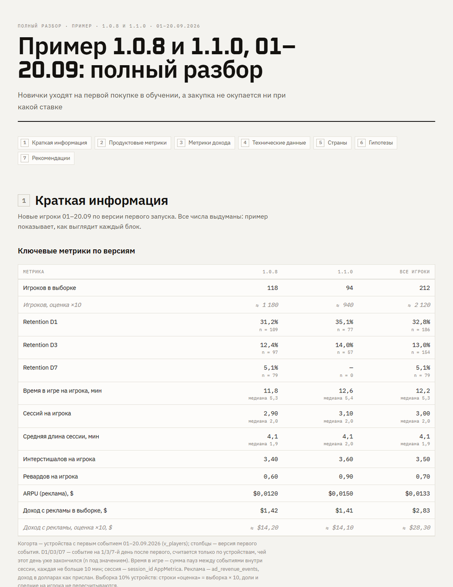
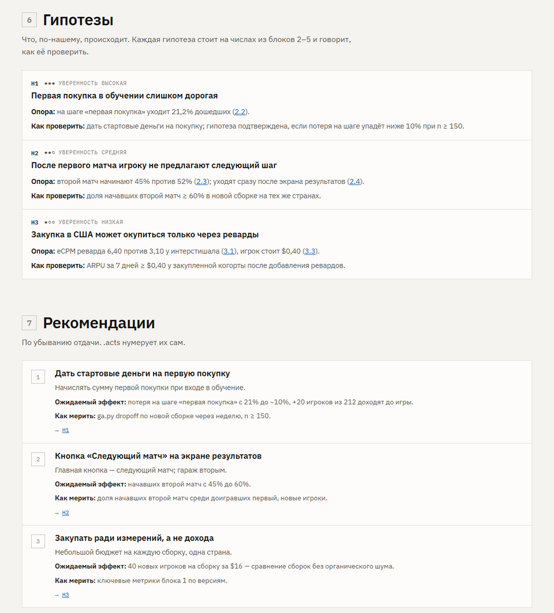

[English](README.md) · **Русский**

# game-analytics-kit

[](https://github.com/Trafalgardi/game-analytics-kit/actions/workflows/ci.yml)
[](LICENSE)


**[Живой пример отчёта](https://trafalgardi.github.io/game-analytics-kit/ru/examples/sample/v002/report.html)** · [Сайт](https://trafalgardi.github.io/game-analytics-kit/ru/) · [Быстрый старт](#быстрый-старт)

Набор, который превращает агента для кода — **Claude Code** или **OpenAI Codex** — в игрового
аналитика. Его ставят в проект игры, и агент сам выгружает сырую аналитику в локальную базу,
разбирается, что значат события именно этой игры, отвечает на продуктовые вопросы и
выпускает версионные отчёты. Каждая версия отчёта — один HTML-файл: он открывается с диска и
пересылается кому угодно.

Набор одинаковый для всех проектов. Всё, что зависит от игры — смысл событий, фильтры,
когорты, запросы, заметки о данных, — агент пишет уже внутри проекта по инструкциям навыков.



- [Что внутри](#что-внутри)
- [Быстрый старт](#быстрый-старт)
- [Работа с Claude Code и Codex](#работа-с-claude-code-и-codex)
- [Что просить](#что-просить)
- [Отчёты](#отчёты)
- [Большие игры](#большие-игры)
- [Обновление и удаление](#обновление-и-удаление)
- [Токен и безопасность](#токен-и-безопасность)
- [Если что-то не так](#если-что-то-не-так)
- [Развитие набора](#развитие-набора)

## Что внутри

**Семь навыков** — инструкции, которые агент подгружает, когда запрос им соответствует.
Ставятся для обоих агентов (`.claude/skills/` и `.agents/skills/`).

| Навык | Что делает |
| --- | --- |
| `analytics-kit` | Точка входа: что установлено, все команды, какой навык дальше, как обновить |
| `analytics-connect-appmetrica` | Находит ключ SDK в коде игры, проводит через выпуск токена только на чтение, находит приложение, запускает первую выгрузку |
| `analytics-data-model` | Разбирает события игры и собирает модель проекта: типизированные события, устройства, фильтр девайсов разработки, сессии, метрики на игрока |
| `analytics-project-audit` | Сравнивает, что шлёт код и что доходит: покрытие, сломанные события, план трекинга, какие данные запросить |
| `analytics-import-external` | Google Ads, AdMob, GA4 / Firebase, Play Console, App Store Connect: что выгрузить, как импортировать и сверить |
| `analytics-research` | Аналитик: вопрос или полный разбор → данные → гипотезы → независимая проверка ключевых чисел → отчёт |
| `analytics-report` | Пишет, собирает, версионирует и публикует отчёт в одной жёсткой структуре |

**Движок** (`kit/gak`, только стандартная библиотека Python — ставить через `pip` ничего не
надо): выгрузка AppMetrica Logs API диапазонами дат в SQLite, выборка устройств для больших
игр, каталог событий, заготовка модели, запросы, импорт CSV из рекламных и магазинных
консолей, стандартные таблицы каждого отчёта (ключевые метрики по версиям, отвалы, действия
по номеру в сессии, уходы после событий),
SVG-графики и сборщик отчётов.

Источники сейчас: **AppMetrica** — события, сессии, установки, доход с рекламы, покупки,
краши и ошибки; цифры рекламных сетей и магазинов — выгрузками CSV или скриншотами. В движке
есть интерфейс источника, чтобы добавить Firebase, GameAnalytics, devtodev и другие.

## Быстрый старт

Нужны:

- игра, которая уже отправляет события в **AppMetrica** (SDK стоит в игре, приложение есть в
  консоли AppMetrica), — это источник, который набор читает сейчас;
- **Python 3.11+** — на Windows лаунчер `py` с python.org; на macOS/Linux везде вместо `py`
  пишите `python3`;
- **git** и установленный **Claude Code** или **Codex**, в который вы вошли.

Ниже `<kit>` — папка, куда клонируется этот репозиторий, `<project>` — корень git-репозитория
игры. Для Unity это папка с `Assets/` и `ProjectSettings/` или корень репозитория над ней, если
Unity-проект лежит во вложенной папке. Набор кладёт туда свою папку `analytics/` — рядом с
`Assets/`, никогда не внутрь (`--analytics-dir` выбирает другое место).

**1. Один раз склонировать набор**

```bash
git clone https://github.com/Trafalgardi/game-analytics-kit.git <kit>
```

**2. Поставить его в проект игры**

```bash
py <kit>/install.py <project>
```

В проекте появятся навыки, `analytics/ga.py` (запуск всех команд) и `analytics/analytics.toml`
(настройки проекта). `--dry-run` покажет план, ничего не меняя.

**3. Получить токен AppMetrica** — OAuth-токен только на чтение от аккаунта Яндекса, который
видит приложение:

1. Откройте <https://oauth.yandex.ru/client/new>, создайте приложение: платформа **Веб-сервисы**,
   Redirect URI `https://oauth.yandex.ru/verification_code`, доступ **AppMetrica →
   `appmetrica:read`**.
2. Скопируйте его **ClientID**, откройте
   `https://oauth.yandex.ru/authorize?response_type=token&client_id=<ClientID>`, подтвердите и
   скопируйте `access_token` из адресной строки.
3. Сохраните его в файл, а не в чат. Один файл на все проекты этого аккаунта:

   ```bash
   mkdir -p ~/.config/game-analytics-kit        # Windows (cmd): mkdir %USERPROFILE%\.config\game-analytics-kit
   ```

   и создайте в этой папке файл `.env` с одной строкой:

   ```
   APPMETRICA_TOKEN=<ваш токен>
   ```

   Только для этого проекта — та же строка в `<project>/analytics/.env` (в git не попадает).

**4. Проверить, что набор видит токен**

```bash
cd <project>
py analytics/ga.py status
```

Должна быть строка `token APPMETRICA_TOKEN: found in ...`. `py analytics/ga.py selftest`
проверит движок офлайн. Все команды `analytics/ga.py` запускаются из корня проекта.

**5. Запустить агента в проекте и попросить обычными словами, по одному запросу**

```bash
cd <project>
claude          # или: codex
```

1. `Подключи AppMetrica и выгрузи последние две недели.` — агент найдёт ключ SDK в коде,
   заполнит `analytics/analytics.toml`, оценит объём данных и запустит выгрузку в фоне
   (10–60 минут на две недели, зависит от игры). Он сам дождётся её и скажет, когда готово;
   загруженные дни видны и в `py analytics/ga.py status`.
2. `Собери модель данных.` — агент разберёт события игры и напишет модель проекта.
3. `Сделай аудит аналитики.` — не обязательно, но советую в первый раз: что игра трекает, что
   сломано, что починить, прежде чем верить цифрам.
4. `Сделай полный анализ игры за последние две недели.` — полный отчёт.

Каждому отчёту агент даёт короткое имя (*slug*) по запросу: отчёт лежит в
`analytics/reports/<slug>/v001/report.html`, список всех — `analytics/reports/index.html`.
Просить можно на любом языке; отчёты пишутся на языке `report_language` из
`analytics/analytics.toml` — по умолчанию русский, `report_language = "en"` для английского.
Агент спрашивает разрешение на каждую команду, пока вы не разрешите их; разрешите
`py analytics/ga.py ...` на сессию, чтобы не подтверждать каждую.

## Работа с Claude Code и Codex

Оба агента находят навыки сами, называть их не нужно.

| | Claude Code | Codex |
| --- | --- | --- |
| Папка навыков | `<project>/.claude/skills/analytics-*` | `<project>/.agents/skills/analytics-*` |
| В диалоге | `cd <project>` → `claude` → запрос | `cd <project>` → `codex` → запрос |
| Одной командой | `cd <project>` → `claude -p "Сделай полный анализ игры за последние две недели"` | `codex exec -C <project> "Сделай полный анализ игры за последние две недели"` |
| Публикация | локальный `report.html` и ссылка на артефакт Claude, где среда это умеет | локальный `report.html` |

- Поставить навыки только для одного агента: `--agents claude` или `--agents codex`.
- Запуску одной командой нужно разрешение выполнять команды
  (`claude -p --dangerously-skip-permissions`,
  `codex exec --dangerously-bypass-approvals-and-sandbox`) — только в проекте, которому вы доверяете.
- Долгие выгрузки идут отдельным фоновым процессом и переживают конец сессии агента; агент
  дожидается их командой `py analytics/ga.py sync --wait`.

## Что просить

| Запрос | Навык | Результат |
| --- | --- | --- |
| «Подключи AppMetrica», «обнови данные», «синк упал» | connect-appmetrica | данные в `analytics/data/analytics.db`, настройки в `analytics.toml` |
| «Собери модель данных», «в 1.2 добавили события» | data-model | `analytics/model/*.sql`, факты в `analytics/notes/project.md` |
| «Сделай аудит аналитики», «что мы трекаем?» | project-audit | отчёт `tracking-audit` и план трекинга |
| «Сделай полный анализ игры за последние две недели» | research | отчёт вида *полный разбор* |
| «Где теряем новичков?», «что изменила 1.2?», «окупается ли закупка?» | research | отчёт вида *вопрос* |
| «Вот выгрузка AdMob / скриншот Google Ads» | import-external | таблицы `ext_*`, цифры сверены с событиями |
| «Обнови отчёт», «поправь цифры в разделе 3» | report | новая версия отчёта |

Всё, что агент узнал о проекте, остаётся в проекте: `analytics/notes/project.md` (устойчивые
факты: смысл событий, фильтры, часовой пояс) и `analytics/notes/findings.md` (датированные
выводы). Каждая следующая сессия начинается с их чтения.

## Отчёты

У каждого отчёта одна и та же структура, поэтому и вы, и следующий агент находите всё на
одном и том же месте:

| № | Блок | Что в нём |
| --- | --- | --- |
| 1 | Краткая информация | таблица ключевых метрик, **столбцы — версии билда** (D1/D3/D7, время в игре, сессии, длина сессии, интерстишалы и реварды на игрока, ARPU, доход, число игроков), и короткие ответы на ваши вопросы |
| 2 | Продуктовые метрики | ретеншен, **таблица отвалов** (шаги загрузки и обучения, затем каждые 30 с первых 10 минут), ядро игры, уходы после негативных событий, экономика |
| 3 | Метрики дохода | реклама по форматам, плейсментам и сетям; покупки |
| 4 | Технические данные | техпроблемы и ошибки аналитики (дубли, пустые поля, расхождения источников) |
| 5 | Страны | разрез по странам в одном месте |
| 6 | Гипотезы | H1, H2… — утверждение, на каких числах стоит (со ссылкой), как проверить, уверенность |
| 7 | Рекомендации | каждая ссылается на гипотезу, с ожидаемым эффектом и тем, как мерить |
| — | Нужные данные, методика | что выгрузить из какой консоли; источники, фильтры, определения |

В **полном разборе** все блоки; в отчёте-**вопросе** — 1, 6, 7 и только нужные из остальных.
Название — ваш запрос («MyGame 0.2.0, 08–21.09: полный разбор»), тезис — строкой под ним.
Факты отделены от интерпретаций, и каждое число из ответов, гипотез и рекомендаций есть в
таблице или на графике отчёта. Отчёт со сломанной структурой или ссылками сборщик не соберёт.



- Собранная версия не меняется. Исправление или новые данные — новая версия (`v002`), она
  начинается с блока «что изменилось».
- `report.html` — один самодостаточный файл (из интернета грузятся только шрифты), светлая и
  тёмная тема, читается с телефона.
- Живые примеры на выдуманных числах:
  [на сайте](https://trafalgardi.github.io/game-analytics-kit/ru/examples/index.html) и в
  [docs/examples/sample-report/ru/analytics/reports/](docs/examples/sample-report/ru/analytics/reports/)
  (`sample` — полный разбор в трёх версиях, `sample-question` — отчёт-вопрос). В клоне откройте
  `index.html`.

## Большие игры

Объём событий у игр различается на два порядка. Перед первой большой выгрузкой агент качает
один день в пробную базу и по объёму выбирает режим:

- `sample = 0.1` в `analytics.toml` — хранится 10% устройств, одни и те же во всех таблицах,
  поэтому доли, медианы и воронки не искажаются. Абсолютные числа (игроки, показы, доход)
  показываются и по выборке, и оценкой (×10) с пометкой «≈ оценка».
- `flatten_params = false` — не раскладывать параметры событий в отдельную таблицу, самую
  тяжёлую часть базы (~6 КБ на событие).

Кроме того, движок отказывается грузить кусок, который не поместится на диск, и говорит, что
поменять. Реальный случай: ~600 тысяч событий в день — с выборкой 5% и без раскладки параметров
две недели грузятся минут за 15 в базу ~200 МБ.

## Обновление и удаление

```bash
git -C <kit> pull                            # взять текущую версию набора
py <kit>/install.py <project>              # обновить проект (та же команда, что установка)
py <kit>/install.py <project> --dry-run    # что изменится
py <kit>/install.py <project> --uninstall  # убрать набор и его навыки; данные, заметки и отчёты остаются
```

Обновление заменяет только то, что принадлежит
набору: папки навыков, которые он поставил (в них лежит метка `.gak-managed`), `analytics/kit/`
и `analytics/ga.py`. Ваши `analytics.toml`, `.env`, данные, модель, запросы, заметки и отчёты не
трогаются никогда, как и ваши собственные навыки в `.claude/skills/`. После обновления:
`py analytics/ga.py status`, `py analytics/ga.py selftest`, `py analytics/ga.py model apply`.
Установленная версия записана в `analytics/kit.install.json`, изменения — в
[CHANGELOG.md](CHANGELOG.md).

Что коммитить в репозиторий игры: `analytics/analytics.toml`, `model/`, `queries/`, `notes/`,
`reports/`, `ga.py`, `kit/`, `kit.install.json` и папки навыков — тогда у всей команды тот же набор вместе с
проектом. `analytics/.gitignore` уже исключает базу, выгрузки из консолей, черновые папки
отчётов и `.env`.

## Токен и безопасность

- Токен AppMetrica — только на чтение (`appmetrica:read`). Порядок поиска: переменная окружения
  `APPMETRICA_TOKEN`, `<project>/analytics/.env`, `~/.config/game-analytics-kit/.env`.
- Набор никогда не печатает, не пишет в логи и не сохраняет токен: ни в базе, ни в отчётах,
  ни в заметках, ни в `analytics.toml`, ни в git. `status` говорит только, где токен найден.
- Не вставляйте токен в чат. Если вставили — агент не повторит его и попросит сохранить в файл;
  если токен мог утечь, отзовите его на <https://oauth.yandex.ru>.
- Ключ SDK из кода игры (UUID) — не секрет, он пишется в `analytics.toml`.
- Рекламные идентификаторы, IP-адреса и операторы не выгружаются, пока вы явно не попросите
  (`sync --with-device-ids`).
- База остаётся на вашей машине. В отчётах — агрегаты, а не данные отдельных устройств.

## Если что-то не так

| Симптом | Что делать |
| --- | --- |
| Нет команды `py` | Поставьте Python 3.11+ с python.org (на Windows он ставит лаунчер `py`); на macOS/Linux — `python3` |
| `status` не находит токен | Проверьте имя файла и строку `APPMETRICA_TOKEN=...` в одном из трёх мест выше |
| `401` при выгрузке | Токена нет, он истёк или выдан аккаунтом, который не видит приложение, — выпустите новый |
| `429` или выгрузка долго висит на «preparing» | AppMetrica готовит выгрузки по одной и держит в очереди не больше трёх; набор ждёт. Не запускайте вторую выгрузку; если один диапазон завис надолго, агент перезапросит его с другим размером куска |
| `database is locked` | Две выгрузки в одну базу. Дождитесь идущей (`py analytics/ga.py sync --wait`) или выгрузите срочную таблицу в отдельный файл: `sync --db data/scratch.db` |
| Кончается место на диске | `sample = 0.1` и `flatten_params = false` в `analytics.toml` или период короче. Доля выборки фиксируется первой выгрузкой в базу: чтобы её сменить, начните новую базу (удалите `analytics/data/analytics.db` или укажите другой `[database].path`) |
| Агент закончил, а данные ещё грузятся | Выгрузка продолжается в фоне; попросите агента продолжить — он дождётся через `sync --wait` |
| `report build` падает | Он перечисляет все проблемы (нет графика, пустое поле, сломаны структура или ссылка); попросите агента исправить и собрать заново |
| В собранном отчёте ошибка | Собранные версии не меняются: попросите новую версию, в ней будет «что изменилось» |
| Codex: «model requires a newer version of Codex» | Обновите Codex CLI или укажите модель, которую он знает: `codex exec -m <модель> ...` |
| Набор ведёт себя не так, как здесь описано | `py analytics/ga.py status` покажет установленную версию; обновите через `install.py` |

## Развитие набора

Начните с [CONTRIBUTING.md](CONTRIBUTING.md) (на английском). Контракт — [docs/DESIGN.md](docs/DESIGN.md)
(сначала меняется он, потом код, потом навыки); опыт, из которого написаны навыки, —
[docs/KNOWLEDGE.md](docs/KNOWLEDGE.md); проверки с настоящими агентами —
[docs/TESTING.md](docs/TESTING.md) и [docs/TEST_LOG.md](docs/TEST_LOG.md). Правила для агентов,
которые работают над самим набором, — [AGENTS.md](AGENTS.md).

```bash
py kit/selftest.py                               # движок, офлайн, синтетические данные
py tests/test_install.py                         # установщик
py docs/examples/sample-report/make_sample.py    # сборщик отчётов и примеры
py install.py <папка тестового проекта> --dry-run # план установки
```

`py install.py <project> --link` ставит ссылки на ваш клон вместо копий: изменение в наборе
сразу видно в проекте.

## Лицензия

[MIT](LICENSE).
